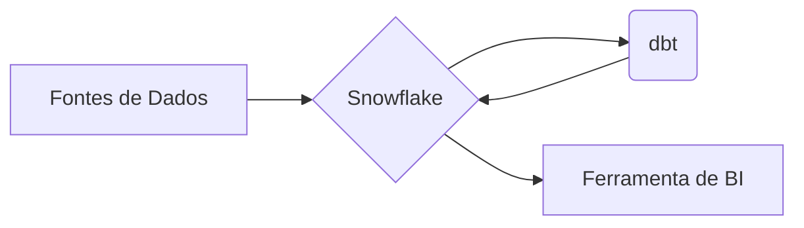

# Projeto de Analytics Engineering 

## 1\. 🚀 Visão Geral do Projeto

Este projeto implementa o pipeline de transformação de dados para a área de Vendas da **NovaDrive Motors**, utilizando dbt para criar um Data Mart robusto e confiável. O objetivo é fornecer ao Diretor de Vendas e sua equipe análises precisas sobre a performance de concessionárias, veículos e vendedores.

A transformação dos dados ocorre diretamente no Data Warehouse, aproveitando sua alta performance e simplicidade.

## 2\. 🏛️ Arquitetura de Dados

A solução segue um fluxo de dados moderno, onde o dbt atua como a camada central de transformação.



  - **Fontes de Dados:** Sistemas legados (PostgreSQL, etc.).
  - **Data Warehouse:** Snowflake.
  - **Transformação:** dbt Core.
  - **Análise:** Ferramentas de Business Intelligence.

## 3\. 📁 Estrutura do Projeto e Modelagem

O projeto é organizado em camadas, garantindo clareza, manutenibilidade e governança.

```
models/
├── staging/      # Limpeza básica e padronização das fontes
│   ├── stg_cidades.sql
│   ├── stg_clientes.sql
│   ├── stg_concessionarias.sql
│   ├── stg_estados.sql
│   ├── stg_veiculos.sql
│   ├── stg_vendas.sql
│   └── stg_vendedores.sql
│
├── marts/        # Modelos de negócio (Dimensões e Fatos)
│   ├── dim_cidades.sql
│   ├── dim_clientes.sql
│   ├── dim_concessionarias.sql
│   ├── dim_estados.sql
│   ├── dim_veiculos.sql
│   ├── dim_vendedores.sql
│   └── fct_vendas.sql
│
└── analyses/     # Modelos para análises de negócio específicas
    ├── analise_vendas_concessionaria.sql
    ├── analise_vendas_temporal.sql
    ├── analise_vendas_veiculo.sql
    └── analise_vendas_vendedor.sql
```

  - **Camada de Stage**: Realiza a limpeza e padronização inicial dos dados de origem. Cada modelo representa uma fonte.
  - **Camada de Dimensões e Fatos**: Constrói o modelo dimensional. As tabelas `dim_` contêm os aspectos de negócio, e a tabela `fct_vendas` consolida os dados quantitativos.
      - A `fct_vendas` é materializada de forma **incremental** para otimizar as execuções, atualizando apenas os novos registros a cada rodada.
  - **Camada Analítica**: Contém modelos de dados agregados, prontos para serem consumidos por ferramentas de BI.

## 4\. ✅ Testes de Qualidade de Dados

A confiabilidade dos dados é assegurada através de testes que validam tanto a integridade estrutural quanto as regras de negócio. Um teste no dbt é uma consulta SQL que, para ser aprovada, deve retornar zero linhas.

**Exemplo de Teste de Regra de Negócio:**
O teste abaixo verifica se alguma venda foi realizada com valor 5% abaixo do preço sugerido do veículo.

```sql
-- tests/assert_valor_venda_within_range.sql
SELECT
    f.venda_id,
    f.valor_venda,
    d.valor_sugerido
FROM {{ ref('fct_vendas') }} f
JOIN {{ ref('dim_veiculos') }} d ON f.veiculo_id = d.veiculo_id
WHERE NOT (f.valor_venda <= d.valor_sugerido AND f.valor_venda >= d.valor_sugerido * 0.95)
```

## 5\. 🌐 Ambientes e Deploy

O projeto utiliza uma estratégia de branches no Git para gerenciar os ambientes de desenvolvimento e produção.

  - **Desenvolvimento (`branch dev`)**: Ambiente de trabalho dos desenvolvedores.
  - **Produção (`branch main`)**: Versão estável do código. O deploy em produção é executado a partir desta branch.

Os **Jobs de Deploy** podem ser configurados para rodar de forma agendada (ex: diariamente) ou sob demanda.

## 6\. ⚙️ Comandos Essenciais

  - **Executar os modelos:**

    ```bash
    dbt run
    ```

  - **Executar os testes:**

    ```bash
    dbt test
    ```

  - **Gerar a documentação do projeto:**

    ```bash
    dbt docs generate
    ```

## 7\. 📊 Análises Geradas

Este projeto fornece os dados necessários para as seguintes análises estratégicas:

  - Vendas por Concessionária
  - Vendas por Modelo de Veículo
  - Vendas por Vendedor
  - Vendas ao Longo do Tempo (Temporal)
